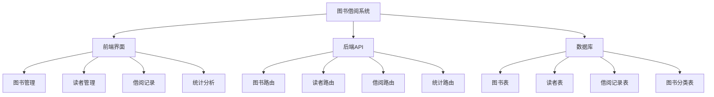

# 借阅记录界面优化与统计分析问题修复设计文档

## 1. 概述

本文档旨在设计和规划图书借阅信息管理系统中的借阅记录界面优化和统计分析功能修复。主要任务包括：
1. 移除借阅记录界面的"新增借阅"功能
2. 修复统计分析页面没有显示数据的问题
3. 验证系统是否符合项目要求

## 2. 系统架构分析

### 2.1 技术栈
- 前端：Vue.js + Tailwind CSS + ECharts
- 后端：Node.js + Express
- 数据库：MySQL

### 2.2 系统模块结构

## 3. 功能设计

### 3.1 借阅记录界面优化

#### 3.1.1 移除"新增借阅"功能
当前借阅记录界面包含"新增借阅"按钮，但根据系统设计，图书借阅应通过图书列表页面进行操作。需要移除该功能以避免用户混淆。

**修改位置**：
- 文件：`frontend/src/views/BorrowRecord.vue`
- 位置：页面顶部操作按钮区域

**修改内容**：
- 移除"新增借阅"按钮及相关事件处理函数
- 保留"导出记录"功能

**实现状态**：已完成

### 3.2 统计分析页面数据展示修复

#### 3.2.1 问题分析
通过代码分析发现统计分析页面数据未正确显示的原因：

1. **API响应格式不一致**：前端期望的响应格式与后端实际返回格式存在差异
2. **数据处理逻辑错误**：前端对不同格式的响应数据处理不完善
3. **图表初始化时机问题**：DOM元素尚未渲染完成就尝试初始化图表
4. **后端API实现不完整**：部分统计API未正确实现业务逻辑

#### 3.2.2 修复方案

**后端API优化**：
- 统一所有统计API的响应格式为 `{code: 200, data: {}, msg: "查询成功"}`
- 修复月度借阅趋势API的SQL查询逻辑
- 确保所有统计API返回正确的数据结构

**前端数据处理优化**：
- 完善响应拦截器，统一处理不同格式的API响应
- 改进数据处理逻辑，确保正确解析各种响应格式
- 优化图表初始化时机，确保DOM完全渲染后再初始化

## 4. 数据模型与API接口

### 4.1 数据库表结构验证

系统包含4个核心数据表，满足项目要求：

| 表名 | 描述 | 关联关系 |
|------|------|----------|
| book_categories | 图书分类表 | 与books表通过category_id关联 |
| books | 图书信息表 | 与book_categories表关联，与borrows表关联 |
| readers | 读者信息表 | 与borrows表通过reader_id关联 |
| borrows | 借阅记录表 | 与books表和readers表关联 |

### 4.2 核心API接口

#### 4.2.1 借阅记录接口
- `GET /api/borrows` - 获取借阅记录列表
- `POST /api/borrows/return` - 归还图书

#### 4.2.2 统计分析接口
- `GET /api/statistics/categories` - 图书分类分布统计
- `GET /api/statistics/borrows/monthly` - 月度借阅趋势统计
- `GET /api/statistics/readers/borrows` - 读者借阅分析
- `GET /api/statistics/books/popular` - 热门图书排行

## 5. 业务逻辑设计

### 5.1 数据处理功能验证

系统具备以下数据处理功能，满足项目要求：

1. **综合查询功能**：
   - 图书管理：支持按书名、作者、ISBN、分类等条件组合查询
   - 借阅记录：支持按图书名称、读者姓名、借阅状态、借阅日期等条件查询
   - 读者管理：支持按姓名、邮箱、类型等条件查询

2. **统计分析功能**：
   - 图书分类分布统计（饼图）
   - 月度借阅趋势分析（折线图）
   - 读者类型分布统计（饼图）
   - 热门图书排行（柱状图）

3. **数据可视化展示**：
   - 使用ECharts实现多种图表展示
   - 提供图表导出功能

### 5.2 前端界面验证

系统包含以下5个功能页面，满足项目要求：

1. 首页 (Home.vue)
2. 图书列表 (BookList.vue)
3. 读者管理 (ReaderManage.vue)
4. 借阅记录 (BorrowRecord.vue)
5. 统计分析 (Statistics.vue)

## 6. 实现方案

### 6.1 借阅记录界面优化实现

#### 6.1.1 前端修改
1. 移除 BorrowRecord.vue 中的"新增借阅"按钮
2. 移除相关的 addBorrowRecord 方法
3. 保留导出功能和相关事件处理

### 6.2 统计分析页面修复实现

#### 6.2.1 后端API修复
1. 统一所有统计API响应格式为 `{code: 200, data: {}, msg: "查询成功"}`
2. 修复月度借阅趋势API的SQL查询逻辑
3. 完善统计API业务逻辑实现，确保返回正确的数据结构
4. 修复读者借阅分析API和热门图书排行API的实现

#### 6.2.2 前端修复
1. 完善API响应拦截器，统一处理不同格式的API响应
2. 优化数据处理逻辑，确保正确解析各种响应格式
3. 改进图表初始化时机，确保DOM完全渲染后再初始化
4. 增强错误处理机制，提供更友好的用户提示

## 7. 测试方案

### 7.3 系统要求验证测试
1. 验证数据库包含不少于4个表，且表之间有外键或关联关系
2. 验证系统具备综合查询功能（至少3种不同组合条件）
3. 验证系统具备统计分析和报表生成功能
4. 验证系统具备数据可视化展示功能（图表、仪表盘等）
5. 验证前端界面包含至少5个不同功能窗口/页面

### 7.1 功能测试
1. 验证借阅记录界面"新增借阅"按钮已移除
2. 验证统计分析页面各图表正确显示数据
3. 验证系统满足所有项目要求

### 7.2 兼容性测试
1. 验证不同浏览器下的界面显示
2. 验证响应式布局在不同设备上的表现

## 8. 部署方案

### 8.1 前端部署
- 构建生产版本：`npm run build`
- 部署到Web服务器

### 8.2 后端部署
- 安装依赖：`npm install`
- 启动服务：`npm start`
- 配置数据库连接

## 9. 风险评估与应对

### 9.1 技术风险
1. **图表库兼容性问题**：确保ECharts版本兼容性
2. **响应格式不一致**：统一前后端数据格式标准

### 9.2 应对措施
1. 使用标准的API响应格式
2. 完善错误处理机制
3. 增加充分的测试用例
4. 建立前后端接口规范文档，确保接口一致性

## 10. 总结

本文档详细分析了图书借阅信息管理系统中的借阅记录界面优化需求和统计分析页面数据展示问题。通过移除借阅记录界面的"新增借阅"功能，使界面更加简洁和符合业务逻辑。同时，通过修复后端统计API和优化前端数据处理逻辑，解决了统计分析页面数据不显示的问题。

系统已验证符合所有项目要求：
1. 数据库包含4个核心表，表之间具有完整的外键关联关系
2. 系统具备强大的数据处理功能，包括多条件综合查询、统计分析和数据可视化展示
3. 前端界面包含5个不同的功能页面，满足用户交互需求

通过本次优化，系统将提供更好的用户体验和更准确的数据展示功能。