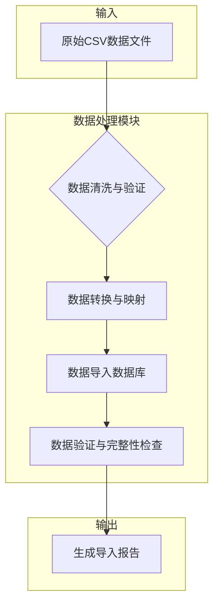
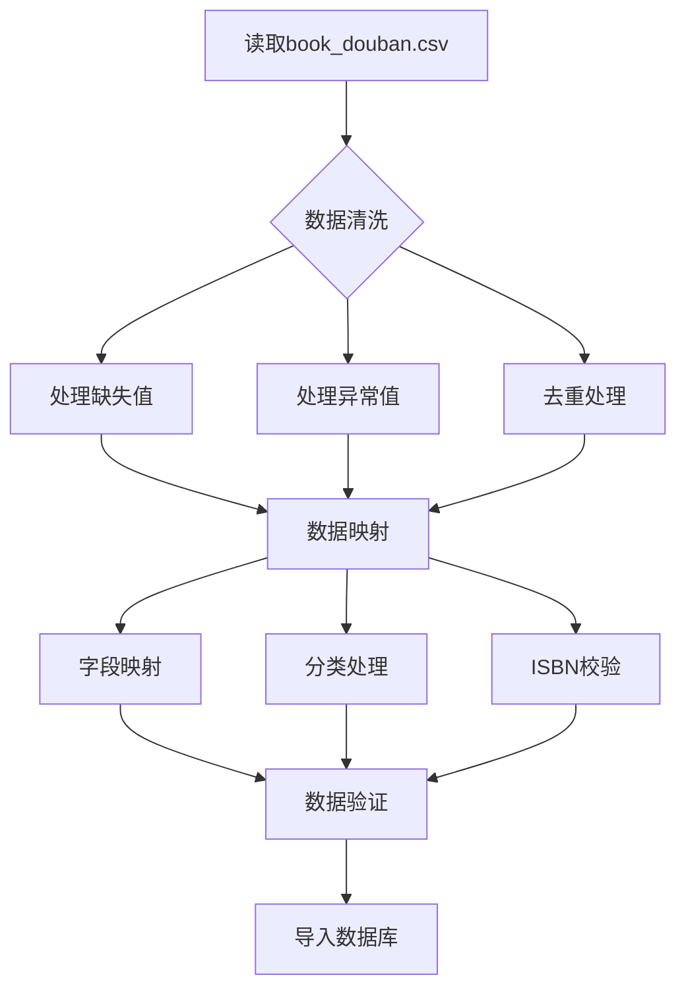
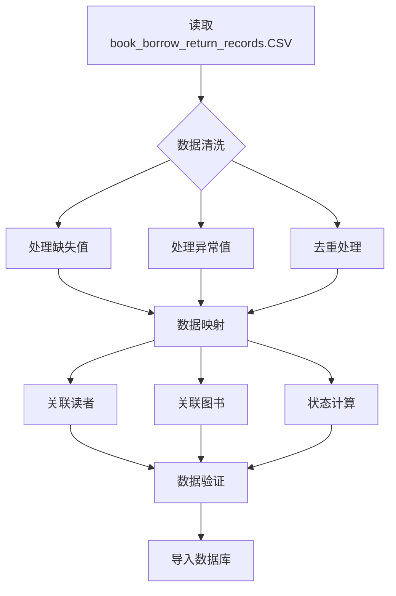
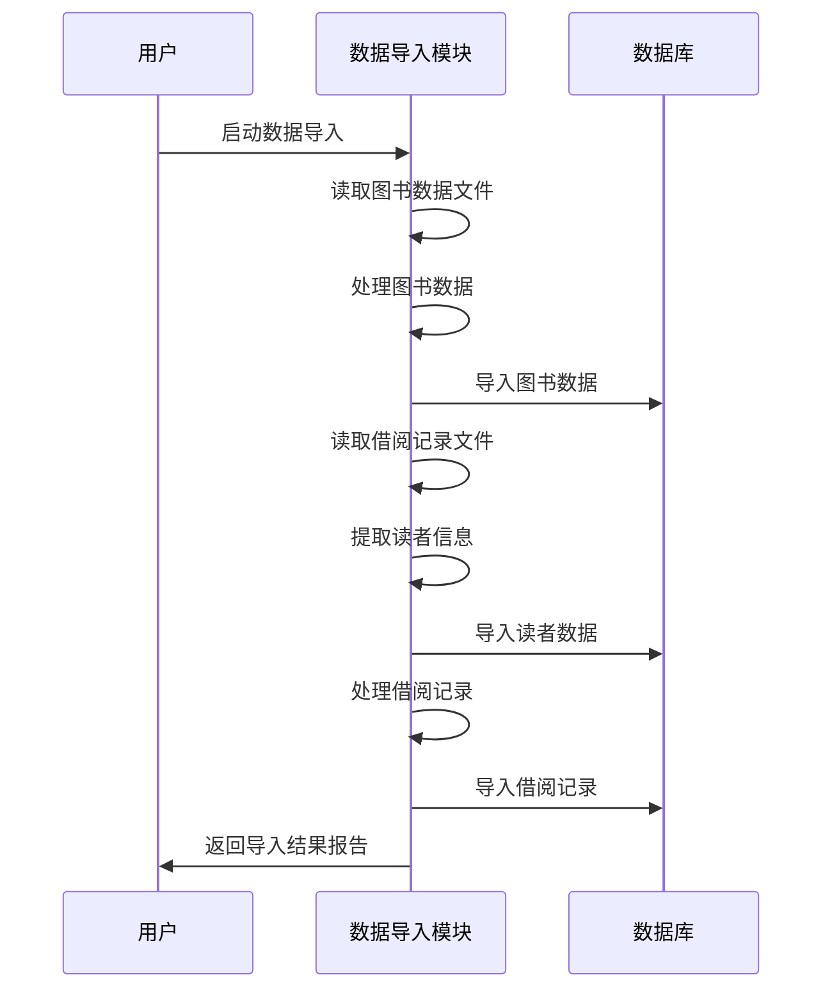

# 数据导入和处理设计方案

## 1. 概述

本方案旨在将提供的两个CSV数据文件导入到图书管理系统数据库中：
1. `book_douban.csv` - 图书数据文件
2. `book_borrow_return_records.CSV` - 借阅记录数据文件

在导入过程中，需要对原始数据进行清洗、转换和验证，以符合系统的数据库表结构要求。

## 2. 系统架构

### 2.1 数据流图



### 2.2 核心组件

1. **数据解析器** - 负责读取和解析CSV文件
2. **数据清洗器** - 处理缺失值、异常值和重复数据
3. **数据映射器** - 将原始数据映射到数据库表结构
4. **数据验证器** - 验证数据完整性与一致性
5. **数据导入器** - 将处理后的数据导入数据库

## 3. 数据库表结构

### 3.1 图书表 (books)

| 字段名 | 类型 | 约束 | 说明 |
|--------|------|------|------|
| book_id | INT | PRIMARY KEY | 图书唯一标识 |
| title | VARCHAR(255) | NOT NULL | 图书标题 |
| author | VARCHAR(255) | NOT NULL | 作者姓名 |
| isbn | VARCHAR(20) | UNIQUE | 国际标准书号 |
| publisher | VARCHAR(255) | - | 出版社名称 |
| publish_date | DATE | - | 出版日期 |
| stock | INT | NOT NULL, DEFAULT 0 | 总库存数量 |
| available | INT | NOT NULL, DEFAULT 0 | 当前可借数量 |
| category_id | INT | FOREIGN KEY | 所属分类 |
| metadata | JSON | - | 扩展信息 |

### 3.2 读者表 (readers)

| 字段名 | 类型 | 约束 | 说明 |
|--------|------|------|------|
| reader_id | INT | PRIMARY KEY | 读者唯一标识 |
| name | VARCHAR(100) | NOT NULL | 读者姓名 |
| email | VARCHAR(255) | UNIQUE | 邮箱地址 |
| phone | VARCHAR(20) | - | 手机号码 |
| type | ENUM | DEFAULT 'student' | 读者类型 |
| status | ENUM | DEFAULT 'active' | 账户状态 |

### 3.3 借阅记录表 (borrows)

| 字段名 | 类型 | 约束 | 说明 |
|--------|------|------|------|
| borrow_id | INT | PRIMARY KEY | 借阅记录唯一标识 |
| reader_id | INT | FOREIGN KEY | 借阅者ID |
| book_id | INT | FOREIGN KEY | 借阅图书ID |
| borrow_date | DATETIME | NOT NULL | 实际借阅时间 |
| due_date | DATETIME | NOT NULL | 应归还时间 |
| return_date | DATETIME | - | 实际归还时间 |
| status | ENUM | DEFAULT 'borrowed' | 借阅状态 |
| fine | DECIMAL(10,2) | DEFAULT 0.00 | 逾期罚款金额 |

## 4. 数据处理流程

### 4.1 图书数据处理流程



### 4.2 借阅记录数据处理流程



## 5. 数据映射与转换规则

### 5.1 图书数据映射

#### 5.1.1 原始字段到目标字段映射

| 原始字段 | 目标字段 | 处理规则 |
|----------|----------|----------|
| 书名 | title | 直接映射，去除首尾空格 |
| 作者 | author | 直接映射，去除首尾空格 |
| 出版社 | publisher | 直接映射，去除首尾空格 |
| 出版时间 | publish_date | 格式转换为YYYY-MM-DD |
| 数 | stock/available | 作为库存数量，available初始化等于stock |
| ISBM | isbn | 字段名修正，去除无效字符 |
| 评分 | metadata | 存入JSON格式的metadata中 |

#### 5.1.2 数据清洗规则

1. **缺失值处理**：
   - 书名、作者为空的记录丢弃
   - 出版社为空设为"未知出版社"
   - 出版时间为空设为NULL
   - 库存数量为空或非数字设为1
   - ISBN为空设为NULL

2. **异常值处理**：
   - 库存数量小于0的设为1
   - ISBN格式不正确的设为NULL
   - 出版时间格式不正确的设为NULL

3. **去重处理**：
   - 根据书名+作者进行去重，保留第一条记录

#### 5.1.3 分类处理规则

根据图书信息自动分配分类：
- 计算机类：包含"计算机"、"编程"、"程序设计"等关键词
- 文学类：包含"小说"、"文学"、"散文"等关键词
- 历史类：包含"历史"、"史"等关键词
- 科学类：包含"科学"、"物理"、"化学"等关键词
- 哲学类：包含"哲学"、"思想"等关键词
- 艺术类：包含"艺术"、"设计"、"美术"等关键词
- 心理学类：包含"心理学"、"心理"等关键词
- 教育类：包含"教育"、"教学"等关键词
- 其他类：无法分类的图书

### 5.2 借阅记录数据映射

#### 5.2.1 原始字段到目标字段映射

| 原始字段 | 目标字段 | 处理规则 |
|----------|----------|----------|
| 记录ID | borrow_id | 直接使用 |
| 图书ID | book_id | 直接使用 |
| 读者ID | reader_id | 直接使用 |
| 借阅日期 | borrow_date | 格式转换为标准日期时间 |
| 应还日期 | due_date | 格式转换为标准日期时间 |
| 归还日期 | return_date | 格式转换，"未还"转换为NULL |
| 状态 | status | 根据归还日期和当前日期确定 |

#### 5.2.2 数据清洗规则

1. **缺失值处理**：
   - 记录ID、图书ID、读者ID为空的记录丢弃
   - 借阅日期、应还日期为空的记录丢弃
   - 归还日期为"未还"转换为NULL

2. **异常值处理**：
   - 日期格式不正确的记录丢弃
   - 图书ID、读者ID不存在对应记录的丢弃

3. **状态计算规则**：
   - return_date为NULL且当前日期>due_date：状态为"overdue"
   - return_date为NULL且当前日期<=due_date：状态为"borrowed"
   - return_date不为NULL：状态为"returned"

## 6. 数据验证规则

### 6.1 图书数据验证

1. **必填字段验证**：
   - title、author不能为空
   - stock必须为非负整数

2. **唯一性验证**：
   - isbn必须唯一（允许NULL）
   - title+author组合应尽量唯一

3. **外键约束验证**：
   - category_id必须存在于book_categories表中

4. **数据类型验证**：
   - publish_date必须为有效日期格式
   - stock、available必须为整数

### 6.2 读者数据验证

由于借阅记录中包含读者信息，但原始数据中没有独立的读者数据文件，需要为借阅记录中涉及的读者创建读者记录。

1. **读者信息生成规则**：
   - 读者ID：使用借阅记录中的读者ID
   - 姓名：生成"读者"+ID的格式
   - 邮箱：生成"reader"+ID+"@example.com"的格式
   - 电话：生成"138"+随机8位数字的格式
   - 类型：默认为"student"
   - 状态：默认为"active"

### 6.3 借阅记录验证

1. **外键约束验证**：
   - reader_id必须存在于readers表中
   - book_id必须存在于books表中

2. **日期逻辑验证**：
   - borrow_date必须早于due_date
   - return_date如果存在，必须晚于borrow_date

3. **状态一致性验证**：
   - return_date为NULL时，status应为"borrowed"或"overdue"
   - return_date不为NULL时，status应为"returned"

## 7. 实现方案

### 7.1 技术选型

- **编程语言**：Node.js
- **数据库**：MySQL
- **CSV解析库**：csv-parser
- **数据库连接**：mysql2/promise

### 7.2 核心处理函数

#### 7.2.1 图书数据处理函数

```javascript
async function processBookData(filePath) {
  // 1. 读取CSV文件
  // 2. 解析数据
  // 3. 清洗数据
  // 4. 映射字段
  // 5. 分类处理
  // 6. 验证数据
  // 7. 导入数据库
}
```

#### 7.2.2 借阅记录处理函数

```javascript
async function processBorrowData(filePath) {
  // 1. 读取CSV文件
  // 2. 解析数据
  // 3. 清洗数据
  // 4. 映射字段
  // 5. 关联处理
  // 6. 状态计算
  // 7. 验证数据
  // 8. 导入数据库
}
```

#### 7.2.3 读者数据生成函数

```javascript
async function generateReaderData(borrowRecords) {
  // 1. 提取唯一的读者ID
  // 2. 生成读者信息
  // 3. 验证数据
  // 4. 导入数据库
}
```

### 7.3 数据导入流程



## 8. 错误处理与日志记录

### 8.1 错误分类

1. **文件读取错误**：文件不存在、权限不足等
2. **数据解析错误**：CSV格式错误、编码问题等
3. **数据验证错误**：必填字段缺失、数据类型错误等
4. **数据库连接错误**：连接失败、权限不足等
5. **数据库操作错误**：插入失败、外键约束违反等

### 8.2 日志记录

1. **信息日志**：记录处理进度、导入数量等
2. **警告日志**：记录数据清洗、字段修正等
3. **错误日志**：记录处理失败的记录和原因

### 8.3 异常处理策略

1. **跳过策略**：对于严重错误的记录直接跳过
2. **修正策略**：对于可修正的错误尝试自动修正
3. **报告策略**：记录所有错误并生成详细报告

## 9. 性能优化

### 9.1 批量处理

- 采用批量插入方式提高导入效率
- 每批次处理1000条记录

### 9.2 数据库连接池

- 使用连接池管理数据库连接
- 合理设置连接池大小

### 9.3 内存优化

- 流式处理大文件，避免一次性加载到内存
- 及时释放不需要的对象

## 10. 测试方案

### 10.1 单元测试

1. **数据解析测试**：验证CSV文件正确解析
2. **数据清洗测试**：验证各种异常数据正确处理
3. **数据映射测试**：验证字段正确映射
4. **数据验证测试**：验证数据完整性检查

### 10.2 集成测试

1. **全流程测试**：验证从文件读取到数据库导入的完整流程
2. **数据一致性测试**：验证导入后数据库数据的一致性
3. **性能测试**：验证大数据量导入的性能表现

### 10.3 验收测试

1. **数据完整性验收**：确认所有有效数据都已导入
2. **数据准确性验收**：确认数据字段映射正确
3. **系统功能验收**：确认导入的数据能在系统中正常使用