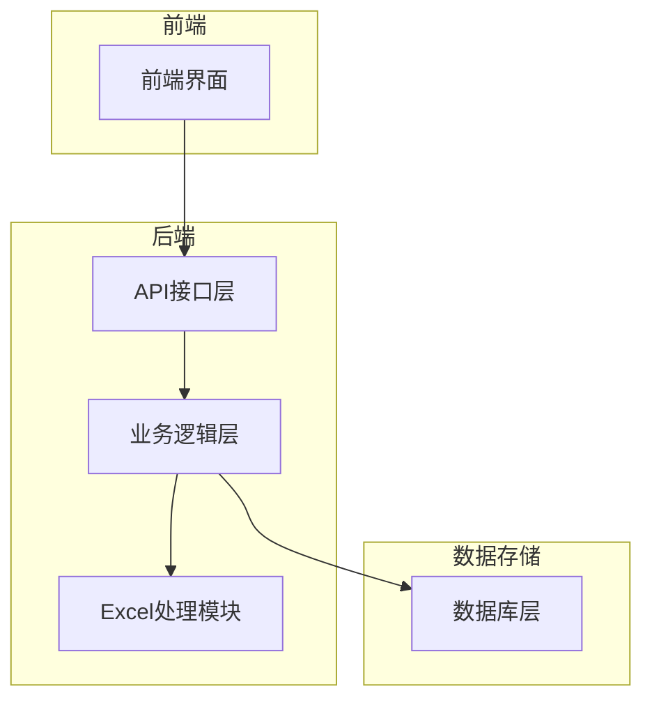
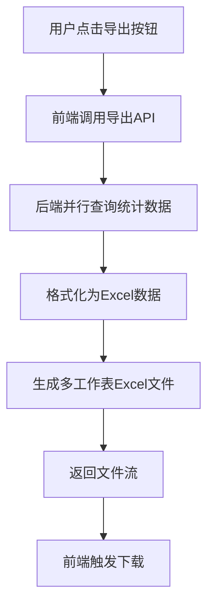
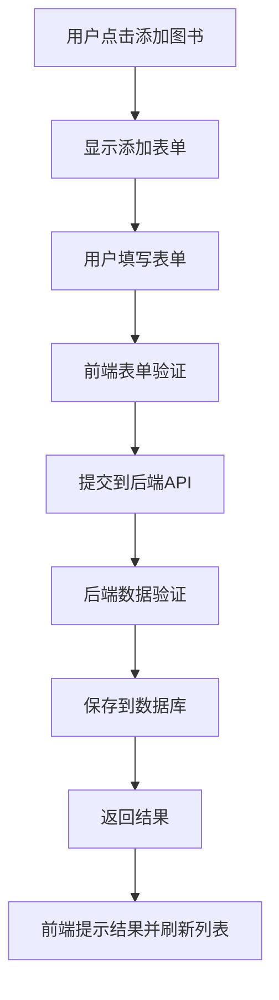

# 统计分析导出报表与图书管理添加图书功能设计文档

## 1. 概述

### 1.1 功能背景
本设计文档旨在实现图书管理系统的两个核心功能：
1. 统计分析页面的导出报表功能：允许用户将统计分析数据导出为Excel格式报表
2. 图书管理页面的添加图书功能：提供完整的图书添加界面和后端处理逻辑

### 1.2 功能目标
- 实现统计分析数据的导出功能，支持多种统计维度
- 实现图书添加功能，包括表单验证和数据持久化
- 确保新功能与现有系统无缝集成，不影响现有功能

### 1.3 影响范围
- 前端：Statistics.vue 和 BookList.vue 组件
- 后端：statistics.js 和 books.js 路由文件
- 工具类：excelHelper.js 工具文件
- API：新增导出接口，复用图书添加接口

## 2. 系统架构

### 2.1 技术栈
- 前端：Vue.js 2 + Tailwind CSS
- 后端：Node.js + Express
- 数据库：MySQL 9.x
- 数据处理：XLSX库用于Excel操作

### 2.2 系统组件交互

### 2.3 现有功能兼容性
- 统计分析功能：保持现有图表展示功能不变
- 图书管理功能：保持现有图书列表、编辑、删除等功能不变
- API接口：新增导出接口，复用现有图书管理接口

## 3. 功能详细设计

### 3.1 统计分析导出报表功能

#### 3.1.1 功能需求
- 支持将统计分析页面的所有图表数据导出为Excel报表
- 导出数据应包含所有统计维度：分类借阅统计、月度借阅趋势、读者类型分布、热门图书TOP10
- 提供导出进度反馈和错误处理机制
- 支持按统计周期导出数据

#### 3.1.2 前端设计
- 在统计分析页面添加"导出报表"按钮，位于页面右上角
- 实现导出状态提示（导出中/导出完成/导出失败）
- 调用后端API获取导出数据并触发浏览器下载
- 保持现有统计分析功能不变

#### 3.1.3 后端设计
- 新增统计报表导出API端点
- 实现数据查询和格式化逻辑
- 使用Excel处理工具生成报表文件
- 返回文件流供前端下载
- 复用现有统计查询逻辑

### 3.2 图书管理添加图书功能

#### 3.2.1 功能需求
- 提供图书添加表单界面，包含所有必要字段
- 实现表单验证和错误提示
- 支持图书分类选择
- 提交数据到后端并处理响应
- 保持现有图书管理功能不变

#### 3.2.2 前端设计
- 在图书管理页面添加"添加图书"按钮，位于页面右上角
- 实现图书添加模态框和表单
- 表单字段包括：书名、作者、ISBN、出版社、分类、库存数量等
- 实现表单验证和提交逻辑
- 添加成功后刷新图书列表

#### 3.2.3 后端设计
- 复用现有的图书添加API端点
- 实现数据验证和处理逻辑
- 确保数据完整性并返回适当响应
- 复用现有图书分类查询逻辑

## 4. API接口设计

### 4.1 统计报表导出接口
- URL: `/api/statistics/export`
- 方法: GET
- 参数: 
  - period: 统计周期（month/quarter/halfyear/year）
  - format: 导出格式（xlsx/csv），默认为xlsx
- 响应: Excel文件流
- 响应头: Content-Type: application/vnd.openxmlformats-officedocument.spreadsheetml.sheet

### 4.2 图书添加接口
- URL: `/api/books`
- 方法: POST
- 参数: 图书信息对象
  - title: 书名（必填）
  - author: 作者（必填）
  - isbn: ISBN号（可选）
  - publisher: 出版社（可选）
  - category_id: 分类ID（必填）
  - stock: 库存数量（必填，默认为1）
- 响应: 
  - code: 状态码（200表示成功）
  - data: 添加的图书信息
  - msg: 操作结果消息

## 5. 数据模型设计

### 5.1 导出数据结构

#### 5.1.1 分类借阅统计表
- 字段：分类名称、借阅次数
- 数据来源：/api/statistics/categories

#### 5.1.2 月度借阅趋势表
- 字段：月份、借阅量、归还量、逾期量
- 数据来源：/api/statistics/borrows/monthly

#### 5.1.3 读者类型分布表
- 字段：读者类型、人数、借阅次数
- 数据来源：/api/statistics/readers/borrows

#### 5.1.4 热门图书TOP10表
- 字段：排名、书名、作者、借阅次数
- 数据来源：/api/statistics/books/popular

### 5.2 图书数据结构
- 书名（title）：字符串，必填
- 作者（author）：字符串，必填
- ISBN（isbn）：字符串，可选，唯一性验证
- 出版社（publisher）：字符串，可选
- 分类（category_id）：整数，必填，外键关联book_categories表
- 库存数量（stock）：整数，必填，默认为1
- 可用数量（available）：整数，自动计算

## 6. 业务逻辑设计

### 6.1 导出报表流程

#### 6.1.1 详细步骤
1. 用户在统计分析页面点击"导出报表"按钮
2. 前端调用/api/statistics/export接口，传递当前统计周期参数
3. 后端并行查询四个维度的统计数据：
   - 分类借阅统计
   - 月度借阅趋势
   - 读者类型分布
   - 热门图书TOP10
4. 后端将查询结果格式化为Excel表格数据
5. 使用XLSX库生成包含四个工作表的Excel文件
6. 返回Excel文件流给前端
7. 前端触发浏览器下载功能

### 6.2 添加图书流程

#### 6.2.1 详细步骤
1. 用户在图书管理页面点击"添加图书"按钮
2. 显示图书添加模态框和表单
3. 用户填写图书信息表单
4. 前端进行基础表单验证（非空检查等）
5. 用户点击提交按钮
6. 前端调用/api/books POST接口提交数据
7. 后端进行详细数据验证：
   - 必填字段检查
   - ISBN唯一性验证
   - 分类ID有效性验证
8. 验证通过后保存到books表
9. 返回成功响应
10. 前端提示添加成功并刷新图书列表

## 7. 错误处理与异常情况

### 7.1 导出报表异常
- 数据查询失败处理：记录日志并返回友好错误提示
- Excel生成失败处理：返回500错误并记录详细错误信息
- 文件下载失败处理：前端提示用户重新尝试
- 网络异常处理：实现重试机制和超时处理
- 大数据量处理：优化查询性能，避免内存溢出

### 7.2 添加图书异常
- 表单验证失败处理：前端实时验证并提示具体错误字段
- 数据库保存失败处理：返回500错误并记录详细错误信息
- 重复ISBN处理：返回400错误并提示用户ISBN已存在
- 分类不存在处理：返回400错误并提示选择有效分类
- 网络异常处理：前端实现重试机制

## 8. 测试策略

### 8.1 功能测试

#### 8.1.1 导出报表功能测试
- 验证不同统计周期数据导出正确性
- 验证Excel文件格式和内容正确性
- 验证四个工作表数据完整性
- 验证文件下载功能

#### 8.1.2 添加图书功能测试
- 验证表单字段验证逻辑
- 验证必填字段提示
- 验证ISBN唯一性检查
- 验证分类选择功能
- 验证添加成功后列表刷新

### 8.2 异常测试
- 网络异常情况测试：模拟网络中断情况
- 数据异常情况测试：输入非法数据验证处理
- 并发操作测试：多用户同时操作的并发处理
- 大数据量测试：大量统计数据导出性能测试
- 数据库连接异常测试：数据库连接失败处理

## 9. 部署与维护

### 9.1 部署要求
- 确保后端依赖库安装完整，特别是xlsx库
- 验证数据库连接正常
- 确保前端构建文件部署正确
- 验证API接口路径配置正确

### 9.2 维护考虑
- 日志记录完善：记录导出操作和添加操作的关键信息
- 性能监控机制：监控导出功能的响应时间和资源消耗
- 错误监控：收集并分析用户操作中的错误信息
- 定期清理：清理临时生成的Excel文件

### 9.3 安全考虑
- 文件下载安全：确保只允许授权用户下载报表
- 数据验证：防止SQL注入和非法数据输入
- 接口权限：确保API接口有适当的权限控制

## 10. 实现计划

### 10.1 开发阶段
1. 后端开发（预计3天）
   - 实现统计报表导出API
   - 完善Excel生成逻辑
   - 复用现有数据查询逻辑

2. 前端开发（预计2天）
   - 在统计分析页面添加导出按钮
   - 实现导出状态提示
   - 在图书管理页面完善添加功能

3. 联调测试（预计1天）
   - 前后端接口联调
   - 功能测试和异常测试

### 10.2 关键实现点
- 统计导出：需要并行查询多个统计数据接口，提高性能
- Excel生成：使用现有的excelHelper工具类，确保格式一致性
- 表单验证：复用现有的表单验证逻辑，保持用户体验一致性
- 错误处理：统一错误处理机制，提供友好的用户提示