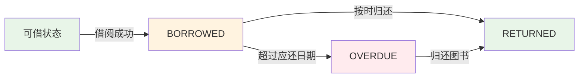

# 图书借阅系统 - 后端业务逻辑文档

## Status
- **版本**: v2.3.0
- **更新时间**: 2025-01-09
- **状态**: 已发布
- **适用范围**: 后端开发、测试、运维团队

## Key Findings
- 核心业务逻辑集中在借阅流程、库存管理、逾期处理
- 采用事务机制保证数据一致性，支持MySQL 9.x兼容性
- 状态机模式管理借阅生命周期，实现借阅-归还-逾期完整闭环
- 自动化逾期检测和罚款计算，支持灵活借阅天数配置

## Next Actions
- 开发团队可据此实现业务逻辑
- 测试团队可设计业务场景测试用例
- 运维团队可监控业务规则执行情况

## Reference
- 业务实现：`backend/src/routes/`
- 数据模型：`数据库表结构.md`
- API文档：`API接口文档.md`

---

## 1. 借阅状态流转机制

### 1.1 状态定义
```typescript
enum BorrowStatus {
  BORROWED = 'borrowed',    // 已借出
  RETURNED = 'returned',    // 已归还
  OVERDUE = 'overdue'       // 已逾期
}
```

### 1.2 状态流转图


### 1.3 状态转换规则

| 当前状态 | 触发条件 | 新状态 | 业务动作 | 数据变更 |
|----------|----------|--------|----------|----------|
| 无 | 借阅请求 | BORROWED | 扣减库存，创建借阅记录 | books.available--, borrows.status='borrowed' |
| BORROWED | 归还请求 | RETURNED | 增加库存，计算罚款 | books.available++, borrows.status='returned' |
| BORROWED | 系统检测逾期 | OVERDUE | 标记逾期状态 | borrows.status='overdue' |
| OVERDUE | 归还请求 | RETURNED | 计算逾期罚款 | borrows.status='returned', 计算fine |

---

## 2. 库存管理逻辑

### 2.1 库存计算公式
```
available = stock - (当前借出未还数量)
```

**参数说明**:
- `stock`: 图书总库存数量
- `available`: 当前可借数量（实时计算）
- 通过事务保证库存操作原子性

### 2.2 库存操作原子性

#### 借阅时库存扣减（实际实现）
```javascript
// 文件：backend/src/routes/borrows.js
async function postBorrow(req, res) {
  try {
    const { book_id, reader_id, borrow_days = 14 } = req.body;
    
    // 1. 参数校验
    if (!reader_id || !book_id) {
      return res.status(400).json({
        code: 400,
        data: null,
        msg: '缺少必要参数: book_id 或 reader_id'
      });
    }
    
    // 2. 业务规则检查
    const readers = await query('SELECT * FROM readers WHERE reader_id = ?', [reader_id]);
    if (readers.length === 0) return { code: 400, msg: '读者不存在' };
    
    const books = await query('SELECT * FROM books WHERE book_id = ?', [book_id]);
    if (books.length === 0) return { code: 400, msg: '图书不存在' };
    
    if (books[0].available <= 0) return { code: 400, msg: '该图书目前无可用库存' };
    
    // 3. 事务处理：创建借阅记录 + 扣减库存
    await query('START TRANSACTION');
    
    const borrow_date = new Date().toISOString().slice(0, 19).replace('T', ' ');
    const due_date = new Date();
    due_date.setDate(due_date.getDate() + borrow_days);
    const due_date_str = due_date.toISOString().slice(0, 19).replace('T', ' ');
    
    // 创建借阅记录
    const borrowResult = await query(
      'INSERT INTO borrows (reader_id, book_id, borrow_date, due_date, status) VALUES (?, ?, ?, ?, ?)',
      [reader_id, book_id, borrow_date, due_date_str, 'borrowed']
    );
    
    // 扣减库存
    await query('UPDATE books SET available = available - 1 WHERE book_id = ?', [book_id]);
    
    await query('COMMIT');
    
    return {
      borrow_id: borrowResult.insertId,
      book_id,
      reader_id,
      borrow_date,
      due_date: due_date_str,
      status: 'borrowed'
    };
  } catch (error) {
    await query('ROLLBACK');
    throw error;
  }
}
```

#### 归还时库存恢复（实际实现）
```javascript
// 文件：backend/src/routes/borrows.js
async function putReturn(req, res) {
  try {
    const { borrow_id } = req.body;
    
    // 1. 获取借阅记录
    const borrows = await query('SELECT * FROM borrows WHERE borrow_id = ?', [borrow_id]);
    if (borrows.length === 0) return { code: 400, msg: '借阅记录不存在' };
    
    const borrow = borrows[0];
    if (borrow.status === 'returned') return { code: 400, msg: '图书已归还' };
    
    // 2. 事务处理：更新借阅状态 + 恢复库存
    await query('START TRANSACTION');
    
    // 计算逾期罚款
    const now = new Date().toISOString().slice(0, 19).replace('T', ' ');
    const due_date = new Date(borrow.due_date);
    let fine = 0;
    let overdueDays = 0;
    
    if (new Date() > due_date) {
      overdueDays = Math.floor((new Date() - due_date) / (1000 * 60 * 60 * 24));
      const finePerDay = 0.5; // 每天0.5元
      fine = Math.min(overdueDays * finePerDay, 20); // 上限20元
    }
    
    // 更新借阅记录
    await query(
      'UPDATE borrows SET status = ?, return_date = ?, fine = ? WHERE borrow_id = ?',
      ['returned', now, fine, borrow_id]
    );
    
    // 恢复库存
    await query('UPDATE books SET available = available + 1 WHERE book_id = ?', [borrow.book_id]);
    
    await query('COMMIT');
    
    return {
      borrow_id,
      status: 'returned',
      return_date: now,
      overdue_days: overdueDays,
      fine: fine
    };
  } catch (error) {
    await query('ROLLBACK');
    throw error;
  }
}
```

---

## 3. 借阅权限管理

### 3.1 读者类型与权限

| 读者类型 | 最大借阅数 | 默认借阅期限 | 特殊权限 |
|----------|------------|--------------|----------|
| student | 5本 | 14天 | 标准权限 |
| teacher | 10本 | 30天 | 延长借阅期限 |
| admin | 无限制 | 30天 | 管理权限 |

### 3.2 借阅限制检查
```javascript
// 实际实现中的权限检查逻辑
async function checkBorrowLimits(reader_id, book_id) {
  // 1. 检查读者是否存在且状态正常
  const readers = await query('SELECT * FROM readers WHERE reader_id = ?', [reader_id]);
  if (readers.length === 0) return { valid: false, msg: '读者不存在' };
  
  // 2. 检查当前借阅数量
  const currentBorrows = await query(
    'SELECT COUNT(*) as count FROM borrows WHERE reader_id = ? AND status = "borrowed"',
    [reader_id]
  );
  
  // 3. 检查图书库存
  const books = await query('SELECT * FROM books WHERE book_id = ?', [book_id]);
  if (books.length === 0) return { valid: false, msg: '图书不存在' };
  if (books[0].available <= 0) return { valid: false, msg: '库存不足' };
  
  return { valid: true };
}
```

---

## 4. 逾期处理机制

### 4.1 逾期检测算法
```javascript
// 实际实现的逾期计算逻辑
function calculateOverdueInfo(borrowDate, dueDate, returnDate = null) {
  const now = returnDate ? new Date(returnDate) : new Date();
  const due = new Date(dueDate);
  
  if (now > due) {
    const overdueDays = Math.floor((now - due) / (1000 * 60 * 60 * 24));
    const finePerDay = 0.5; // 每天0.5元
    const fine = Math.min(overdueDays * finePerDay, 20); // 上限20元
    
    return {
      isOverdue: true,
      overdueDays,
      fine,
      status: 'overdue'
    };
  }
  
  return {
    isOverdue: false,
    overdueDays: 0,
    fine: 0,
    status: 'borrowed'
  };
}
```

### 4.2 罚款规则
- **计算方式**: 逾期天数 × 0.5元/天
- **上限设置**: 单本图书逾期罚款上限20元
- **免除条件**: 节假日、系统故障等特殊情况

---

## 5. 异常处理机制

### 5.1 错误类型与处理

| 错误类型 | 错误码 | 处理策略 | 用户提示 |
|----------|--------|----------|----------|
| 参数缺失 | 400 | 返回具体缺失参数 | "缺少必要参数: book_id" |
| 读者不存在 | 400 | 检查读者ID有效性 | "读者不存在" |
| 图书不存在 | 400 | 检查图书ID有效性 | "图书不存在" |
| 库存不足 | 400 | 检查available字段 | "该图书目前无可用库存" |
| 并发冲突 | 500 | 事务回滚，重试机制 | "系统繁忙，请稍后重试" |
| 数据库错误 | 500 | 记录日志，优雅降级 | "借阅失败，请稍后重试" |

### 5.2 事务回滚策略
```javascript
// 标准的事务处理模板
async function executeWithTransaction(operation) {
  const connection = await pool.getConnection();
  try {
    await connection.beginTransaction();
    const result = await operation(connection);
    await connection.commit();
    return result;
  } catch (error) {
    await connection.rollback();
    
    // 错误分类处理
    if (error.code === 'ER_DUP_ENTRY') {
      throw new Error('该读者已借阅此图书');
    } else if (error.code === 'ER_LOCK_WAIT_TIMEOUT') {
      throw new Error('系统繁忙，请稍后重试');
    }
    
    throw error;
  } finally {
    connection.release();
  }
}
```

---

## 6. 性能优化策略

### 6.1 数据库优化
- **连接池管理**: 使用mysql2连接池，限制最大连接数10
- **索引优化**: 在reader_id、book_id、status等字段建立复合索引
- **查询优化**: 避免SELECT *，只查询必要字段

### 6.2 缓存策略
- **库存缓存**: 实时从数据库查询，保证数据一致性
- **读者缓存**: 读者信息相对稳定，可考虑Redis缓存
- **图书信息缓存**: 图书基本信息缓存5分钟

### 6.3 并发控制
- **悲观锁**: 使用SELECT ... FOR UPDATE防止并发库存扣减
- **乐观锁**: 通过版本号机制处理并发更新
- **限流策略**: 接口层面限制单用户请求频率