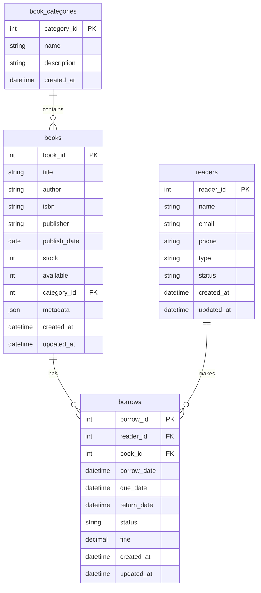
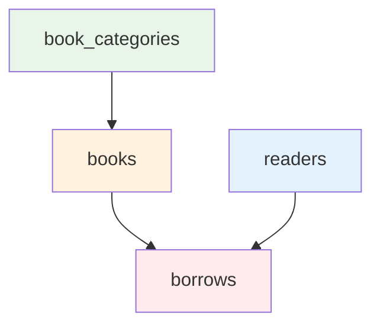

# 图书借阅系统 - 数据库表结构文档

## Status
- **版本**: v2.3.0
- **更新时间**: 2025-01-09
- **状态**: 已发布
- **适用范围**: 数据库设计、开发、运维团队

## Key Findings
- 采用MySQL 9.x兼容性设计，支持现代SQL特性
- 四张核心表：图书分类、图书、读者、借阅记录
- 完整索引设计优化查询性能，支持多条件筛选
- 触发器自动维护库存一致性，避免数据异常

## Next Actions
- 开发团队可据此创建数据库表结构
- 运维团队可执行初始化脚本
- 测试团队可设计数据完整性测试用例

## Reference
- 初始化脚本：`backend/scripts/test_data_init.js`
- 业务逻辑：`后端业务逻辑文档.md`
- API文档：`API接口文档.md`

---

## 1. 数据库设计概览

### 1.1 表结构关系图


### 1.2 数据库版本兼容性
- **MySQL版本**: 9.0+
- **字符集**: utf8mb4_unicode_ci
- **存储引擎**: InnoDB
- **事务支持**: 完全支持ACID事务

---

## 2. 核心表结构定义

### 2.1 图书分类表 (book_categories)

#### 表结构
```sql
CREATE TABLE book_categories (
    category_id INT AUTO_INCREMENT PRIMARY KEY COMMENT '分类ID，主键',
    name VARCHAR(100) NOT NULL COMMENT '分类名称',
    description TEXT COMMENT '分类描述',
    created_at TIMESTAMP DEFAULT CURRENT_TIMESTAMP COMMENT '创建时间'
) ENGINE=InnoDB DEFAULT CHARSET=utf8mb4 COLLATE=utf8mb4_unicode_ci COMMENT='图书分类表';
```

#### 索引设计
```sql
-- 唯一索引：分类名称
CREATE UNIQUE INDEX idx_category_name ON book_categories(name);
```

#### 示例数据
| category_id | name | description |
|-------------|------|-------------|
| 1 | 计算机科学 | 编程、算法、数据结构等 |
| 2 | 文学小说 | 小说、散文、诗歌等 |
| 3 | 历史 | 中国历史、世界历史等 |

---

### 2.2 图书表 (books)

#### 表结构
```sql
CREATE TABLE books (
    book_id INT AUTO_INCREMENT PRIMARY KEY COMMENT '图书ID，主键',
    title VARCHAR(255) NOT NULL COMMENT '图书标题',
    author VARCHAR(255) NOT NULL COMMENT '作者',
    isbn VARCHAR(20) UNIQUE COMMENT 'ISBN号',
    publisher VARCHAR(255) COMMENT '出版社',
    publish_date DATE COMMENT '出版日期',
    stock INT NOT NULL DEFAULT 0 COMMENT '总库存数量',
    available INT NOT NULL DEFAULT 0 COMMENT '可用库存数量',
    category_id INT NOT NULL COMMENT '分类ID，外键',
    metadata JSON COMMENT '扩展元数据(JSON格式)',
    created_at TIMESTAMP DEFAULT CURRENT_TIMESTAMP COMMENT '创建时间',
    updated_at TIMESTAMP DEFAULT CURRENT_TIMESTAMP ON UPDATE CURRENT_TIMESTAMP COMMENT '更新时间',
    
    -- 外键约束
    CONSTRAINT fk_books_category 
        FOREIGN KEY (category_id) REFERENCES book_categories(category_id) 
        ON DELETE RESTRICT ON UPDATE CASCADE
) ENGINE=InnoDB DEFAULT CHARSET=utf8mb4 COLLATE=utf8mb4_unicode_ci COMMENT='图书信息表';
```

#### 索引设计
```sql
-- 主键索引：book_id (自动创建)

-- 唯一索引：ISBN号
CREATE UNIQUE INDEX idx_book_isbn ON books(isbn);

-- 普通索引：分类ID
CREATE INDEX idx_book_category ON books(category_id);

-- 复合索引：标题+作者，优化搜索性能
CREATE INDEX idx_book_title_author ON books(title, author);

-- 库存查询索引：可用库存和总库存
CREATE INDEX idx_book_stock ON books(available, stock);
```

#### 字段说明
| 字段名 | 数据类型 | 约束 | 业务含义 |
|--------|----------|------|----------|
| book_id | INT | PRIMARY KEY | 图书唯一标识 |
| title | VARCHAR(255) | NOT NULL | 图书标题 |
| author | VARCHAR(255) | NOT NULL | 作者姓名 |
| isbn | VARCHAR(20) | UNIQUE | 国际标准书号 |
| publisher | VARCHAR(255) | - | 出版社名称 |
| publish_date | DATE | - | 出版日期 |
| stock | INT | NOT NULL, DEFAULT 0 | 总库存数量 |
| available | INT | NOT NULL, DEFAULT 0 | 当前可借数量 |
| category_id | INT | FOREIGN KEY | 所属分类 |
| metadata | JSON | - | 扩展信息（如封面、简介等） |

#### 示例数据
| book_id | title | author | isbn | publisher | publish_date | stock | available | category_id |
|---------|-------|--------|------|-----------|--------------|-------|-----------|-------------|
| 1 | JavaScript高级程序设计 | Nicholas C. Zakas | 978-7-115-27579-0 | 人民邮电出版社 | 2024-01-15 | 10 | 8 | 1 |
| 2 | 算法导论 | Thomas H. Cormen | 978-7-111-40701-0 | 机械工业出版社 | 2023-05-20 | 5 | 5 | 1 |

---

### 2.3 读者表 (readers)

#### 表结构
```sql
CREATE TABLE readers (
    reader_id INT AUTO_INCREMENT PRIMARY KEY COMMENT '读者ID，主键',
    name VARCHAR(100) NOT NULL COMMENT '读者姓名',
    email VARCHAR(255) UNIQUE COMMENT '邮箱地址',
    phone VARCHAR(20) COMMENT '手机号码',
    type ENUM('student', 'teacher', 'admin') DEFAULT 'student' COMMENT '读者类型',
    status ENUM('active', 'inactive', 'suspended') DEFAULT 'active' COMMENT '账户状态',
    created_at TIMESTAMP DEFAULT CURRENT_TIMESTAMP COMMENT '创建时间',
    updated_at TIMESTAMP DEFAULT CURRENT_TIMESTAMP ON UPDATE CURRENT_TIMESTAMP COMMENT '更新时间'
) ENGINE=InnoDB DEFAULT CHARSET=utf8mb4 COLLATE=utf8mb4_unicode_ci COMMENT='读者信息表';
```

#### 索引设计
```sql
-- 主键索引：reader_id (自动创建)

-- 唯一索引：邮箱地址
CREATE UNIQUE INDEX idx_reader_email ON readers(email);

-- 普通索引：读者类型和状态
CREATE INDEX idx_reader_type_status ON readers(type, status);

-- 姓名搜索索引
CREATE INDEX idx_reader_name ON readers(name);
```

#### 字段说明
| 字段名 | 数据类型 | 约束 | 业务含义 |
|--------|----------|------|----------|
| reader_id | INT | PRIMARY KEY | 读者唯一标识 |
| name | VARCHAR(100) | NOT NULL | 读者姓名 |
| email | VARCHAR(255) | UNIQUE | 邮箱地址（登录账号） |
| phone | VARCHAR(20) | - | 手机号码 |
| type | ENUM | DEFAULT 'student' | 读者类型（学生/教师/管理员） |
| status | ENUM | DEFAULT 'active' | 账户状态（活跃/停用/暂停） |

#### 示例数据
| reader_id | name | email | phone | type | status |
|-----------|------|-------|-------|------|--------|
| 1 | 张三 | zhangsan@example.com | 13800138001 | student | active |
| 2 | 李四 | lisi@example.com | 13800138002 | teacher | active |

---

### 2.4 借阅记录表 (borrows)

#### 表结构
```sql
CREATE TABLE borrows (
    borrow_id INT AUTO_INCREMENT PRIMARY KEY COMMENT '借阅ID，主键',
    reader_id INT NOT NULL COMMENT '读者ID，外键',
    book_id INT NOT NULL COMMENT '图书ID，外键',
    borrow_date DATETIME NOT NULL COMMENT '借阅日期',
    due_date DATETIME NOT NULL COMMENT '应还日期',
    return_date DATETIME COMMENT '实际归还日期',
    status ENUM('borrowed', 'returned', 'overdue') DEFAULT 'borrowed' COMMENT '借阅状态',
    fine DECIMAL(10,2) DEFAULT 0.00 COMMENT '逾期罚款金额',
    created_at TIMESTAMP DEFAULT CURRENT_TIMESTAMP COMMENT '创建时间',
    updated_at TIMESTAMP DEFAULT CURRENT_TIMESTAMP ON UPDATE CURRENT_TIMESTAMP COMMENT '更新时间',
    
    -- 外键约束
    CONSTRAINT fk_borrows_reader 
        FOREIGN KEY (reader_id) REFERENCES readers(reader_id) 
        ON DELETE RESTRICT ON UPDATE CASCADE,
    
    CONSTRAINT fk_borrows_book 
        FOREIGN KEY (book_id) REFERENCES books(book_id) 
        ON DELETE RESTRICT ON UPDATE CASCADE,
        
    -- 防止重复借阅
    CONSTRAINT uk_active_borrow UNIQUE (reader_id, book_id, status)
) ENGINE=InnoDB DEFAULT CHARSET=utf8mb4 COLLATE=utf8mb4_unicode_ci COMMENT='借阅记录表';
```

#### 索引设计
```sql
-- 主键索引：borrow_id (自动创建)

-- 外键索引：读者ID和图书ID
CREATE INDEX idx_borrows_reader ON borrows(reader_id);
CREATE INDEX idx_borrows_book ON borrows(book_id);

-- 状态索引：借阅状态
CREATE INDEX idx_borrows_status ON borrows(status);

-- 时间索引：借阅日期和应还日期
CREATE INDEX idx_borrows_dates ON borrows(borrow_date, due_date);

-- 复合索引：读者+状态，用于查询当前借阅
CREATE INDEX idx_borrows_reader_status ON borrows(reader_id, status);
```

#### 字段说明
| 字段名 | 数据类型 | 约束 | 业务含义 |
|--------|----------|------|----------|
| borrow_id | INT | PRIMARY KEY | 借阅记录唯一标识 |
| reader_id | INT | FOREIGN KEY | 借阅者ID |
| book_id | INT | FOREIGN KEY | 借阅图书ID |
| borrow_date | DATETIME | NOT NULL | 实际借阅时间 |
| due_date | DATETIME | NOT NULL | 应归还时间 |
| return_date | DATETIME | - | 实际归还时间 |
| status | ENUM | DEFAULT 'borrowed' | 借阅状态 |
| fine | DECIMAL(10,2) | DEFAULT 0.00 | 逾期罚款金额 |

#### 示例数据
| borrow_id | reader_id | book_id | borrow_date | due_date | return_date | status | fine |
|-----------|-----------|---------|-------------|----------|-------------|--------|------|
| 1 | 1 | 1 | 2025-01-01 10:00:00 | 2025-01-15 10:00:00 | NULL | borrowed | 0.00 |
| 2 | 2 | 2 | 2024-12-20 14:30:00 | 2025-01-03 14:30:00 | 2025-01-05 16:00:00 | returned | 1.00 |

---

## 3. 数据完整性约束

### 3.1 外键约束关系


### 3.2 业务规则约束

#### 库存一致性规则
- **触发器**: 自动维护available字段，确保available ≤ stock
- **业务逻辑**: 借阅时available--，归还时available++
- **异常处理**: 库存不足时拒绝借阅

#### 借阅状态规则
- **状态转换**: borrowed → returned/overdue
- **时间约束**: return_date ≥ borrow_date
- **罚款计算**: fine > 0 仅当status = 'returned'且逾期

---

## 4. 索引优化策略

### 4.1 查询场景分析

#### 高频查询场景
1. **图书搜索**: 按标题、作者、ISBN搜索
2. **借阅查询**: 按读者ID查询当前借阅
3. **库存查询**: 查询可借图书列表
4. **统计查询**: 按时间段统计借阅量

#### 索引设计原则
```sql
-- 1. 图书搜索优化
EXPLAIN SELECT * FROM books 
WHERE title LIKE '%JavaScript%' AND author LIKE '%Zakas%';
-- 使用idx_book_title_author索引

-- 2. 借阅查询优化
EXPLAIN SELECT * FROM borrows 
WHERE reader_id = 1 AND status = 'borrowed';
-- 使用idx_borrows_reader_status索引

-- 3. 库存查询优化
EXPLAIN SELECT * FROM books WHERE available > 0;
-- 使用idx_book_stock索引
```

### 4.2 性能监控指标

#### 索引使用情况
```sql
-- 查看索引使用统计
SELECT 
    table_name,
    index_name,
    cardinality,
    sub_part,
    packed,
    NULLABLE
FROM information_schema.statistics 
WHERE table_schema = 'library_system';
```

---

## 5. 初始化与测试数据

### 5.1 数据库初始化脚本
```sql
-- 完整的数据库初始化脚本（基于test_data_init.js）
-- 文件：backend/scripts/test_data_init.js

-- 1. 创建数据库
CREATE DATABASE IF NOT EXISTS library_system 
CHARACTER SET utf8mb4 COLLATE utf8mb4_unicode_ci;

USE library_system;

-- 2. 创建表结构（如上定义）
-- 3. 插入测试数据
```

### 5.2 测试数据集

#### 图书分类数据
```sql
INSERT INTO book_categories (name, description) VALUES
('计算机科学', '编程、算法、数据结构、软件工程等'),
('文学小说', '小说、散文、诗歌、戏剧等'),
('历史', '中国历史、世界历史、历史人物传记等'),
('科学', '物理、化学、生物、天文等'),
('经济', '经济学理论、金融学、管理学等');
```

#### 图书数据
```sql
INSERT INTO books (title, author, isbn, publisher, publish_date, stock, available, category_id, metadata) VALUES
('JavaScript高级程序设计', 'Nicholas C. Zakas', '978-7-115-27579-0', '人民邮电出版社', '2024-01-15', 10, 10, 1, '{"cover": "javascript.jpg", "pages": 800}'),
('算法导论', 'Thomas H. Cormen', '978-7-111-40701-0', '机械工业出版社', '2023-05-20', 5, 5, 1, '{"cover": "algorithm.jpg", "pages": 750}'),
('百年孤独', '加西亚·马尔克斯', '978-7-5442-5864-5', '南海出版公司', '2023-03-10', 8, 8, 2, '{"cover": "one_hundred_years.jpg", "pages": 360}');
```

#### 读者数据
```sql
INSERT INTO readers (name, email, phone, type, status) VALUES
('张三', 'zhangsan@example.com', '13800138001', 'student', 'active'),
('李四', 'lisi@example.com', '13800138002', 'teacher', 'active'),
('王五', 'wangwu@example.com', '13800138003', 'student', 'active');
```

---

## 6. 数据库维护与监控

### 6.1 数据一致性检查

#### 库存一致性验证
```sql
-- 检查库存异常
SELECT 
    b.book_id,
    b.title,
    b.stock,
    b.available,
    (SELECT COUNT(*) FROM borrows 
     WHERE book_id = b.book_id AND status = 'borrowed') as borrowed_count
FROM books b
WHERE b.available != (b.stock - borrowed_count);
```

#### 借阅状态验证
```sql
-- 检查状态异常
SELECT 
    br.borrow_id,
    br.reader_id,
    br.book_id,
    br.status,
    br.due_date,
    CASE 
        WHEN br.status = 'borrowed' AND br.due_date < NOW() THEN '应标记为逾期'
        WHEN br.status = 'returned' AND br.return_date IS NULL THEN '缺少归还日期'
        ELSE '正常'
    END as check_result
FROM borrows br
WHERE br.status IN ('borrowed', 'returned');
```

### 6.2 性能优化建议

#### 表分区策略
```sql
-- 借阅记录按年份分区（适用于大数据量）
CREATE TABLE borrows_partitioned (
    borrow_id INT AUTO_INCREMENT,
    reader_id INT NOT NULL,
    book_id INT NOT NULL,
    borrow_date DATETIME NOT NULL,
    -- 其他字段...
    PRIMARY KEY (borrow_id, YEAR(borrow_date))
) PARTITION BY RANGE (YEAR(borrow_date)) (
    PARTITION p2023 VALUES LESS THAN (2024),
    PARTITION p2024 VALUES LESS THAN (2025),
    PARTITION p2025 VALUES LESS THAN (2026)
);
```

#### 定期维护任务
```sql
-- 1. 更新表统计信息
ANALYZE TABLE books;
ANALYZE TABLE readers;
ANALYZE TABLE borrows;

-- 2. 优化表结构
OPTIMIZE TABLE books;
OPTIMIZE TABLE readers;
OPTIMIZE TABLE borrows;

-- 3. 清理过期数据
DELETE FROM borrows 
WHERE status = 'returned' 
  AND return_date < DATE_SUB(NOW(), INTERVAL 3 YEAR);
```