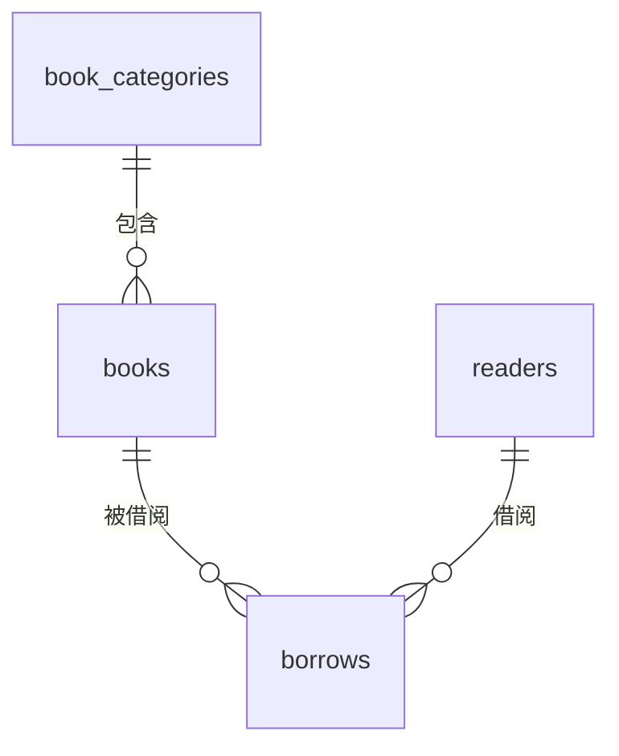

# 数据库表结构设计（含初始化脚本）

## 一、数据库设计概述

本图书借阅信息管理系统采用MySQL关系型数据库，设计了4个核心表：
- `book_categories`（图书分类表）
- `readers`（读者表）
- `books`（图书表）
- `borrows`（借阅表）

表关系如下：
- `books.category_id` 关联 `book_categories.category_id`
- `borrows.book_id` 关联 `books.book_id`
- `borrows.reader_id` 关联 `readers.reader_id`

## 二、表结构设计

### 1. 图书分类表 (book_categories)

| 字段名 | 类型 | 约束 | 描述 |
|--------|------|------|------|
| category_id | INT | PRIMARY KEY, AUTO_INCREMENT | 分类ID |
| name | VARCHAR(50) | NOT NULL, UNIQUE | 分类名称 |
| description | TEXT | | 分类描述 |
| created_at | TIMESTAMP | DEFAULT CURRENT_TIMESTAMP | 创建时间 |

### 2. 读者表 (readers)

| 字段名 | 类型 | 约束 | 描述 |
|--------|------|------|------|
| reader_id | INT | PRIMARY KEY, AUTO_INCREMENT | 读者ID |
| name | VARCHAR(50) | NOT NULL | 读者姓名 |
| student_id | VARCHAR(20) | UNIQUE | 学号/工号 |
| type | ENUM('student', 'teacher', 'staff', 'other') | NOT NULL | 读者类型 |
| email | VARCHAR(100) | UNIQUE | 电子邮箱 |
| phone | VARCHAR(20) | | 电话号码 |
| created_at | TIMESTAMP | DEFAULT CURRENT_TIMESTAMP | 创建时间 |

### 3. 图书表 (books)

| 字段名 | 类型 | 约束 | 描述 |
|--------|------|------|------|
| book_id | INT | PRIMARY KEY, AUTO_INCREMENT | 图书ID |
| title | VARCHAR(100) | NOT NULL | 图书标题 |
| author | VARCHAR(50) | NOT NULL | 作者 |
| category_id | INT | NOT NULL, FOREIGN KEY | 分类ID（关联book_categories） |
| publisher | VARCHAR(50) | | 出版社 |
| publish_date | DATE | | 出版日期 |
| isbn | VARCHAR(20) | UNIQUE | ISBN号 |
| stock | INT | NOT NULL DEFAULT 0 | 总库存 |
| available | INT | NOT NULL DEFAULT 0 | 可借数量 |
| metadata | JSON | | 扩展元数据 |
| created_at | TIMESTAMP | DEFAULT CURRENT_TIMESTAMP | 创建时间 |

### 4. 借阅表 (borrows)

| 字段名 | 类型 | 约束 | 描述 |
|--------|------|------|------|
| borrow_id | INT | PRIMARY KEY, AUTO_INCREMENT | 借阅ID |
| book_id | INT | NOT NULL, FOREIGN KEY | 图书ID（关联books） |
| reader_id | INT | NOT NULL, FOREIGN KEY | 读者ID（关联readers） |
| borrow_date | TIMESTAMP | DEFAULT CURRENT_TIMESTAMP | 借阅日期 |
| due_date | TIMESTAMP | NOT NULL | 应还日期 |
| return_date | TIMESTAMP | NULL | 实际归还日期 |
| status | ENUM('borrowed', 'returned', 'overdue') | NOT NULL DEFAULT 'borrowed' | 借阅状态 |

## 三、表关系图

## 四、初始化脚本说明

初始化脚本 `db/init.sql` 包含以下内容：

1. **表创建**：按以下顺序创建4个表
   - `book_categories`（图书分类表）
   - `readers`（读者表）
   - `books`（图书表）
   - `borrows`（借阅表）

2. **外键关联**：
   - `books.category_id` 关联 `book_categories.category_id`
   - `borrows.book_id` 关联 `books.book_id`
   - `borrows.reader_id` 关联 `readers.reader_id`

3. **测试数据插入**：
   - 5条图书分类记录
   - 8条读者记录（包含学生、教师和职员类型）
   - 10条图书记录（涵盖文学、科技、历史等类别）
   - 15条借阅记录（包含已归还、正在借阅和逾期三种状态）

4. **图书可用数量更新**：根据借阅记录更新图书的可借数量

## 五、测试数据覆盖场景

测试数据覆盖以下3种综合查询场景：

1. **按分类查询**：包含"文学类"图书（如《红楼梦》《西游记》等）
2. **按读者类型查询**：包含"student"类型读者（如张三、李四等）
3. **按出版社查询**：包含"人民文学"出版社图书（如四大名著）

## 六、脚本执行步骤

1. 先创建图书分类表（book_categories），因为图书表依赖分类表
2. 创建读者表（readers），因为借阅表依赖读者表
3. 创建图书表（books），因为借阅表依赖图书表
4. 创建借阅表（borrows）
5. 插入测试数据
6. 更新图书可用数量

---
版本：v1.0.0，适配图书借阅系统MVP阶段