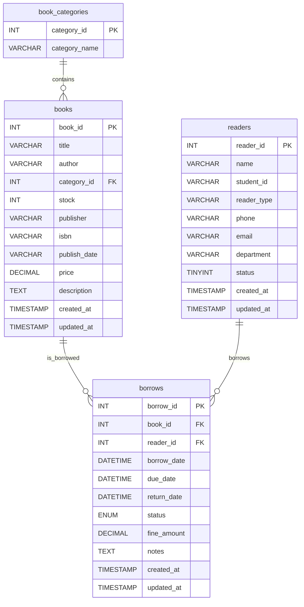

# P0 需求清单（含数据表设计）

## 一、核心功能模块

### 1. 图书管理
- **功能描述**：负责图书信息的录入、修改、删除等操作
- **验收标准**：管理员能够通过系统界面完成图书信息的增删改查
- **优先级理由**：图书是图书馆的核心资源，图书管理是系统最基础的功能

### 2. 读者管理
- **功能描述**：管理读者信息，包括注册、信息更新、注销等
- **验收标准**：管理员能够通过系统界面完成读者信息的增删改查
- **优先级理由**：读者是图书馆服务的对象，读者管理是借阅流程的基础

### 3. 借阅记录管理
- **功能描述**：记录和跟踪图书的借阅、归还情况
- **验收标准**：系统能够准确记录借阅和归还信息，并支持查询
- **优先级理由**：借阅流程是图书馆的核心业务流程

### 4. 分类管理
- **功能描述**：对图书进行分类管理，便于查找和统计
- **验收标准**：管理员能够创建和管理图书分类
- **优先级理由**：图书分类是提高图书查找效率的关键

## 二、多条件查询需求

### 1. 按书名+分类查询
- **功能描述**：读者可以同时通过书名和分类来精确查找图书
- **验收标准**：系统支持组合查询条件，快速返回匹配结果
- **用户价值**：提高读者查找图书的效率和准确性

### 2. 按读者类型+作者查询
- **功能描述**：不同类型的读者可以查找特定作者的图书
- **验收标准**：系统支持读者类型和作者的组合查询
- **用户价值**：满足不同读者群体的个性化需求

### 3. 按库存+出版社查询
- **功能描述**：读者可以优先查看有库存的特定出版社的图书
- **验收标准**：系统支持库存状态和出版社的组合查询
- **用户价值**：帮助读者快速找到可借阅的图书

## 三、前端页面功能定位

### 1. 首页（仪表盘）
- **功能定位**：展示系统概览和关键指标，如在借图书数量、逾期图书数量等
- **数据支持**：从borrows表、books表获取统计数据

### 2. 图书列表页
- **功能定位**：展示和管理图书信息，提供图书查询、添加、编辑等功能
- **数据支持**：主要使用books表和book_categories表

### 3. 读者管理页
- **功能定位**：管理读者信息，包括读者注册、信息修改、读者查询等
- **数据支持**：主要使用readers表

### 4. 借阅记录页
- **功能定位**：查看和管理借阅记录，包括借书、还书、逾期记录等
- **数据支持**：主要使用borrows表，并关联books表和readers表

### 5. 统计分析页
- **功能定位**：提供数据统计和分析功能，生成各类报表和图表
- **数据支持**：综合使用所有数据表进行统计分析

## 四、数据表设计

### 1. books（图书表）
| 字段名 | 数据类型 | 说明 | 约束 |
|-------|---------|------|------|
| book_id | INT | 图书ID | 主键，自增 |
| title | VARCHAR(100) | 书名 | 非空 |
| author | VARCHAR(50) | 作者 | 非空 |
| category_id | INT | 分类ID | 外键，关联book_categories表的category_id |
| stock | INT | 库存数量 | 非空，默认0 |
| publisher | VARCHAR(50) | 出版社 | 非空 |

**数据表支撑的功能**：图书信息管理、图书查询、库存管理

### 2. book_categories（分类表）
| 字段名 | 数据类型 | 说明 | 约束 |
|-------|---------|------|------|
| category_id | INT | 分类ID | 主键，自增 |
| category_name | VARCHAR(50) | 分类名称 | 非空，唯一 |

**数据表支撑的功能**：图书分类管理、按分类查询图书

### 3. readers（读者表）
| 字段名 | 数据类型 | 说明 | 约束 |
|-------|---------|------|------|
| reader_id | INT | 读者ID | 主键，自增 |
| name | VARCHAR(50) | 读者姓名 | 非空 |
| student_id | VARCHAR(20) | 学号/读者证号 | 非空，唯一 |
| reader_type | VARCHAR(20) | 读者类型 | 非空，可选值：学生/教师 |

**数据表支撑的功能**：读者信息管理、读者类型筛选

### 4. borrows（借阅表）
| 字段名 | 数据类型 | 说明 | 约束 |
|-------|---------|------|------|
| borrow_id | INT | 借阅ID | 主键，自增 |
| book_id | INT | 图书ID | 外键，关联books表的book_id |
| reader_id | INT | 读者ID | 外键，关联readers表的reader_id |
| borrow_date | DATETIME | 借阅日期 | 非空 |
| due_date | DATETIME | 应还日期 | 非空 |
| return_date | DATETIME | 实际归还日期 | 可空，未归还时为NULL |

**数据表支撑的功能**：借阅记录查询、借阅流程管理、逾期提醒、统计分析

## 五、数据表关系图

## 六、功能实现状态跟踪

### 已实现功能（基于页面截图验证）
- ✅ 基础图书信息管理（book_management.png）
- ✅ 基础读者信息管理（reader_management.png）
- ✅ 基础借阅记录管理（borrow_record.png）
- ✅ 基础搜索功能
- ✅ 首页基础统计展示（Home.png）

### 待实现功能（基于原型图差异分析）
- ❌ 图表可视化功能（饼图、折线图、柱状图）
- ❌ 高级搜索和筛选功能
- ❌ 逾期提醒和还书功能
- ❌ 批量操作功能
- ❌ 数据导入导出功能
- ❌ 统计分析模块

### 详细差异分析文档
详见：[模块功能差异对比表](./module-function-differences.md)

## 七、下一阶段开发计划

### 第1阶段：核心功能完善（1-2周）
1. 实现还书功能
2. 添加逾期提醒机制
3. 优化借阅状态管理

### 第2阶段：用户体验提升（2-3周）
1. 添加首页统计图表
2. 实现高级搜索和筛选
3. 优化页面交互体验

### 第3阶段：管理功能增强（3-4周）
1. 批量操作功能
2. 数据导入导出
3. 统计分析模块

---
**版本**：v1.1.0  
**创建日期**：2023年10月25日  
**更新日期**：2024年1月 - 基于已实现功能与原型图对比更新